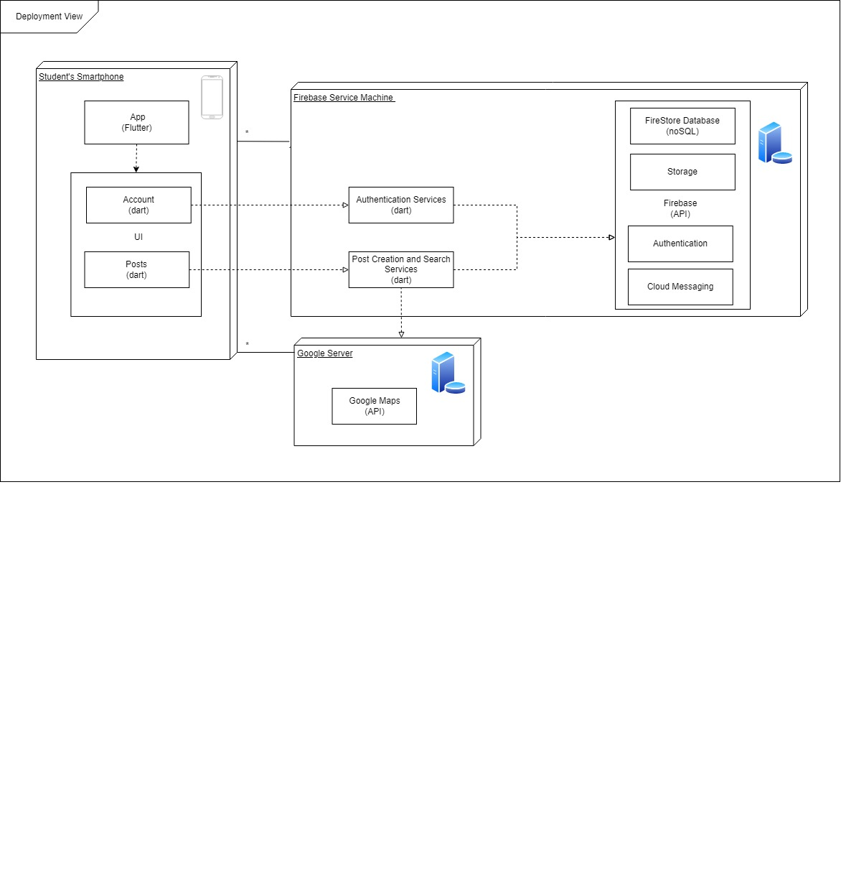

# Architecture and Design

In this section, we'll provide a brief description of our Logical Architecture, Physical Architecture and Vertical Prototype.

## Logical architecture

## Physical architecture

The application front-end is mainly created with  Flutter, an open-source UI software development kit, and ought to use the Google Maps API to complement it, as well. However, the application back-end is solely based on Firebase, a mobile application development platform that offers a range of services.

Our physical architecture is constituded by 3 different physical devices:

* **The User Mobile Device**: This device will run the application and serve as an intermediary betweeen the user and all remote services.
* **Firebase Service Machine**: Calls to this device, are made from the User Mobile Device, through the Firebase API. This device is reponsible for:
  * An online database, Firestore, to store and search data;
  * Providing online storage for profile and post images;
  * The User Authentication service;
* **Google Server**: This device is reponsible for providing location services, for search purposes.

## Vertical prototype

The vertical prototype features the main page of the application.
This page allows the user to navigate through posts of lost or found items. It possesses a list of scrollable categories on top, followed by a search bar, along with a button on the lower corner, whose fucntion will be to allow the user to post an item as well. The functionality of these will be implemented in the future.
Each post features a automatic blurred image, a title, tags (which are horizontally scrollable, in case they don't fit) and its location.
The user can read more about the first post, by tapping on it.
