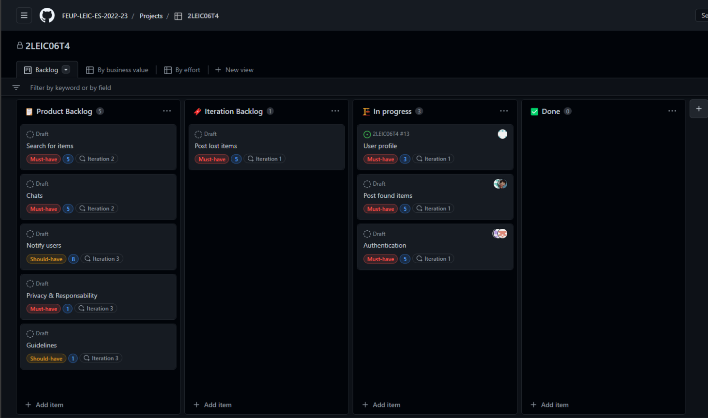
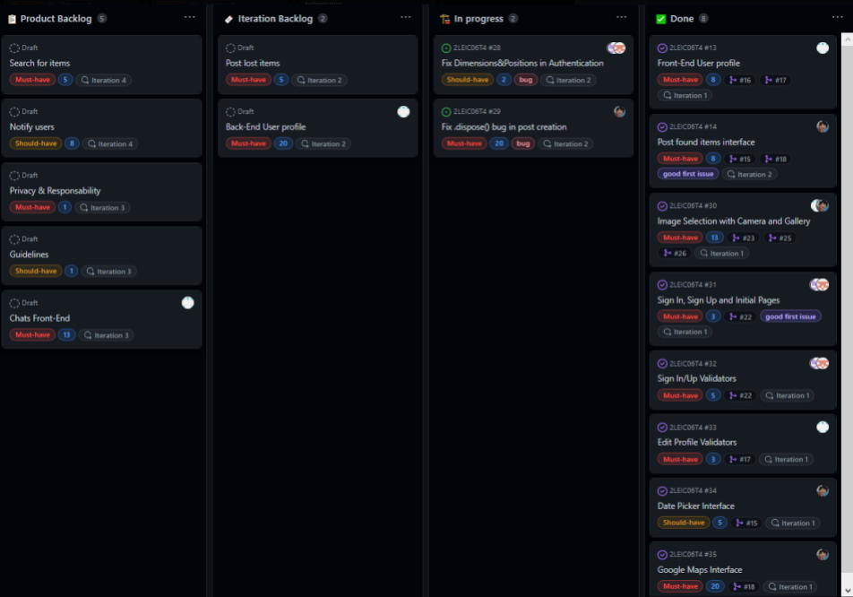
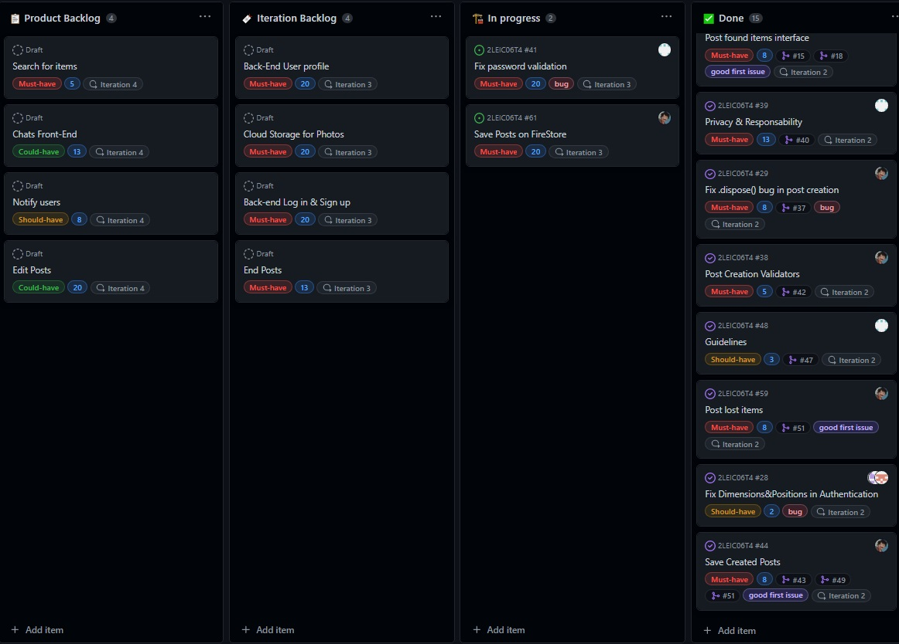
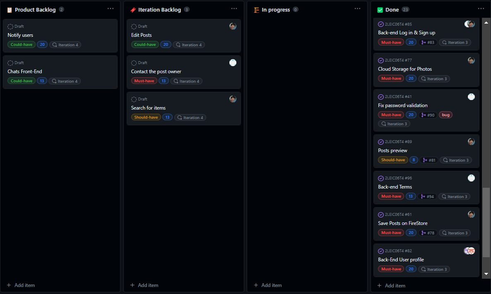

# Project management

## Backlog management

In order to facilitate project management, we used Githubs Projects.

Github Projects provides us with a [Board](https://github.com/orgs/FEUP-LEIC-ES-2022-23/projects/68), which we used for backlog management, where we are able to easily manage the product backlog, the current iteration backlog, work in progress and completed features, along with a easy way to assign tasks to the development team members, while also providing a way of classifying the effort level for each task.

### Board history

End of iteration 0

End of iteration 1

End of iteration 2

End of iteration 3

End of iteration 4

## Release management

Each version before the offical release, should be labeled with 0.X, where X starts on 1, and is incremented with each release.

After the official release, all versions should follow the same rule, but with 1.X and X starting on 0.
