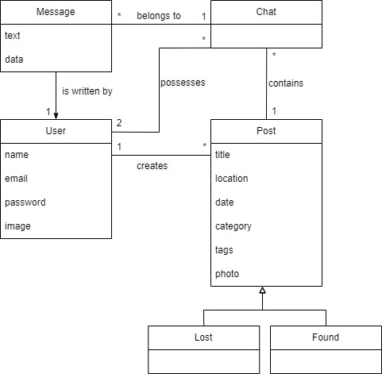

# Requirements

## User Stories

User Stories were created as issues and can be found within the [Gihub Project Board](https://github.com/orgs/FEUP-LEIC-ES-2022-23/projects/68).

## Domain model

* User: represents each user of the application;
* Post: represents an item that was either found or lost, by an user;
  * Found: subclass of Post, represents an item that was found, by an user;  
  * Lost: subclass of Post, repsents an item that was los, by an user;
* Chat: each Post may have multiple chats, where one of the users is the author of the post and the other is somebody that messaged the author, through the post;
* Message: represents a message sent by an user within a chat;  

